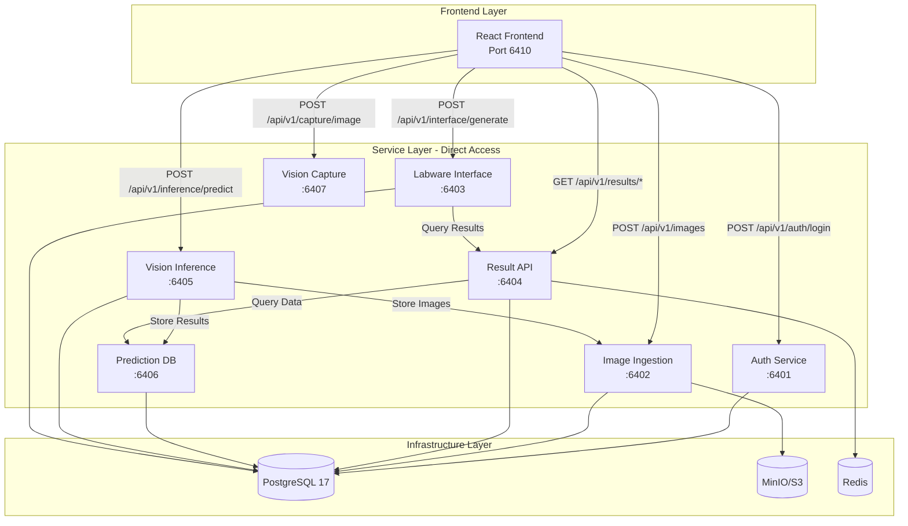

# Gateway & Service Connectivity

## Overview

Production deployments route all traffic through an **API gateway / reverse proxy**. The gateway terminates TLS, validates JWTs, applies rate limiting, injects CORS headers และส่งต่อคำขอไปยัง service ย่อย (auth, results, inference ฯลฯ) ตามเส้นทางที่กำหนด

ระหว่างการพัฒนา เราใช้ **webpack-dev-server proxy** ให้ frontend (`http://localhost:6410`) เรียก `/api/v1/*` แล้ว dev server forward ไปยัง service ที่พอร์ต 6401‑6407 โดยอัตโนมัติ จึงไม่มีปัญหา CORS

## Architecture

```mermaid
graph TB
    subgraph "Frontend Layer"
        FE[React Frontend<br/>Webpack Dev Server (6410)]
    end

    subgraph "Gateway Layer"
        GW[API Gateway / Reverse Proxy<br/>JWT Validation + Rate Limit + CORS]
    end

    subgraph "Service Layer"
        AUTH[Auth Service<br/>:6401]
        IMG[Image Ingestion<br/>:6402]
        RES[Result API<br/>:6404]
        INF[Vision Inference<br/>:6403]
        LAB[Labware Interface<br/>:6405]
        PDB[Prediction DB<br/>:6406]
        CAP[Vision Capture<br/>Device LAN]
    end

    FE -->|HTTPS| GW
    GW -->|/api/v1/auth/*| AUTH
    GW -->|/api/v1/images/*| IMG
    GW -->|/api/v1/results/*| RES
    GW -->|/api/v1/inference/*| INF
    GW -->|/api/v1/interface/*| LAB
    GW -->|/api/v1/predictions/*| PDB
    GW -->|/api/v1/capture/*| CAP
```

## Development Workflow

- ค่า `.env` ฝั่ง frontend ชี้ทั้งหมดไปที่ `http://localhost:6410`
- `webpack.config.js` กำหนด proxy สำหรับเส้นทาง `/api/v1/...` และ `/ws/capture`
- Backend service ไม่ต้องเปิด CORS plugin เพื่อหลีกเลี่ยง config ซ้ำซ้อน

```bash
# .env (frontend development)
VITE_AUTH_SERVICE_URL=http://localhost:6410
VITE_IMAGE_SERVICE_URL=http://localhost:6410
VITE_RESULTS_SERVICE_URL=http://localhost:6410
VITE_VISION_SERVICE_URL=http://localhost:6410
VITE_LABWARE_SERVICE_URL=http://localhost:6410
VITE_PREDICTION_SERVICE_URL=http://localhost:6410
VITE_VISION_CAPTURE_SERVICE_URL=http://localhost:6410
VITE_WS_CAPTURE_URL=ws://localhost:6410/ws/capture
```

## Production Deployment

1. Gateway (เช่น Nginx/Envoy) รับคำขอทั้งหมดจากผู้ใช้
2. ตรวจสอบ JWT (`issuer`, `audience`) และเพิ่ม header อ้างอิงถึงผู้ใช้
3. กำหนด rate limiting และ logging ใน gateway เดียว
4. Forward คำขอไป service ภายใน (auth, results, inference ฯลฯ)
5. Vision capture ที่เครื่องลูกค้าเรียก gateway (`https://api.example.com/api/v1/capture/...`)

### ตัวอย่าง Nginx

```nginx
location /api/v1/capture/ {
    proxy_pass http://device-lan-ip:6407/api/v1/capture/;
    proxy_set_header Host $host;
    proxy_set_header X-Real-IP $remote_addr;
}

location /ws/capture {
    proxy_pass http://device-lan-ip:6407/ws/capture;
    proxy_http_version 1.1;
    proxy_set_header Upgrade $http_upgrade;
    proxy_set_header Connection "Upgrade";
}
```

ส่วนบริการอื่นให้เพิ่ม location mapping ตามพอร์ตที่ระบุใน `docs/14-Service-Port-Allocation.md`

## Security Considerations

- JWT secret และ service token จัดการผ่าน gateway
- CORS allowlist ตั้งที่ gateway เท่านั้น
- Logging/Monitoring รวมศูนย์, backend บันทึกเฉพาะ business log
- Service เชื่อ header (`x-user-id` ฯลฯ) เฉพาะเมื่อ gateway เพิ่มให้

## Device Layer

vision-capture-service ทำงานบนเครื่องลูกค้าหรือภายในโรงงาน:

- ใช้ `.env` ตั้งค่า `JWT_SECRET`, `CAMERA_BACKEND`, `BASLER_SERIAL` เป็นต้น
- เรียก API gateway ผ่าน HTTPS
- ไม่ต้องเปิด CORS ใน service ย่อย

## Summary

- **Dev**: ใช้ webpack proxy (6410) จัดการ CORS
- **Prod**: ใช้ API gateway ตรวจสอบและ forward คำขอทั้งหมด
- Backend services เรียบง่ายขึ้นเพราะไม่ต้องดูแล CORS/Rate limiting เอง
- เอกสารนี้แทนที่แนวคิด “Direct Service Access” เดิม และระบุแนวทางที่ใช้อยู่ในปัจจุบัน
# Direct Service Access Architecture

## Overview

The Microplate AI System uses a **Direct Service Access** architecture instead of a traditional API Gateway. This document explains the rationale, implementation, and implications of this architectural decision.

## Why No API Gateway?

### Advantages

1. **Reduced Complexity**
   - No single point of failure at the gateway
   - Simpler deployment and scaling
   - Fewer moving parts to maintain

2. **Lower Latency**
   - Direct communication eliminates gateway hop
   - Faster response times for real-time operations
   - Better performance for large file uploads (images)

3. **Service Autonomy**
   - Each service manages its own authentication
   - Independent scaling and deployment
   - Service-specific rate limiting and CORS policies

4. **Development Flexibility**
   - Teams can deploy services independently
   - Easier to implement service-specific features
   - No gateway configuration bottleneck

### Trade-offs

1. **Distributed Security**
   - Each service must implement authentication
   - Consistent security across services requires discipline
   - More points to secure and monitor

2. **Client Complexity**
   - Frontend must know multiple service endpoints
   - More complex error handling
   - Service discovery needed

3. **Cross-Cutting Concerns**
   - Rate limiting per service (not global)
   - Logging and monitoring requires aggregation
   - CORS configuration per service

## Architecture Diagram



## Implementation Strategy

### 1. Authentication per Service

Each service validates JWT tokens independently:

```typescript
// Common middleware for all services
import { FastifyRequest, FastifyReply } from 'fastify';
import jwt from 'jsonwebtoken';

export async function authenticateRequest(
  request: FastifyRequest,
  reply: FastifyReply
) {
  try {
    const authHeader = request.headers.authorization;
    
    if (!authHeader || !authHeader.startsWith('Bearer ')) {
      return reply.code(401).send({
        success: false,
        error: {
          code: 'UNAUTHORIZED',
          message: 'Missing or invalid authorization header'
        }
      });
    }

    const token = authHeader.substring(7);
    const decoded = jwt.verify(token, process.env.JWT_SECRET!);
    
    request.user = decoded;
  } catch (error) {
    return reply.code(401).send({
      success: false,
      error: {
        code: 'INVALID_TOKEN',
        message: 'Invalid or expired token'
      }
    });
  }
}
```

### 2. CORS Configuration per Service

Each service configures CORS independently:

```typescript
// Fastify CORS plugin configuration
import cors from '@fastify/cors';

await fastify.register(cors, {
  origin: [
    'http://localhost:3000',      // Development
    'http://localhost:6410',      // Frontend
    'https://app.microplate.com', // Production
  ],
  credentials: true,
  methods: ['GET', 'POST', 'PUT', 'DELETE', 'OPTIONS'],
  allowedHeaders: ['Content-Type', 'Authorization'],
  exposedHeaders: ['X-Total-Count', 'X-Request-Id'],
  maxAge: 86400, // 24 hours
});
```

### 3. Rate Limiting per Service

```typescript
// Service-specific rate limiting
import rateLimit from '@fastify/rate-limit';

await fastify.register(rateLimit, {
  max: 100,                    // Max requests
  timeWindow: '1 minute',      // Time window
  cache: 10000,                // Cache size
  allowList: ['127.0.0.1'],    // Whitelist
  redis: redisClient,          // Redis for distributed limiting
  skipOnError: true,           // Continue on Redis error
  keyGenerator: (request) => {
    // Use user ID if authenticated, IP otherwise
    return request.user?.id || request.ip;
  },
  errorResponseBuilder: (request, context) => {
    return {
      success: false,
      error: {
        code: 'RATE_LIMIT_EXCEEDED',
        message: 'Too many requests, please try again later',
        retryAfter: context.after
      }
    };
  }
});
```

### 4. Service Discovery

Frontend configuration for service endpoints:

```typescript
// src/config/services.ts
export const SERVICES = {
  AUTH: import.meta.env.VITE_AUTH_SERVICE_URL || 'http://localhost:6401',
  IMAGE: import.meta.env.VITE_IMAGE_SERVICE_URL || 'http://localhost:6402',
  LABWARE: import.meta.env.VITE_LABWARE_SERVICE_URL || 'http://localhost:6403',
  RESULTS: import.meta.env.VITE_RESULTS_SERVICE_URL || 'http://localhost:6404',
  INFERENCE: import.meta.env.VITE_INFERENCE_SERVICE_URL || 'http://localhost:6405',
  PREDICTION_DB: import.meta.env.VITE_PREDICTION_DB_SERVICE_URL || 'http://localhost:6406',
  CAPTURE: import.meta.env.VITE_CAPTURE_SERVICE_URL || 'http://localhost:6407',
};

// API client with service-specific base URLs
export class ApiClient {
  private baseUrl: string;
  
  constructor(service: keyof typeof SERVICES) {
    this.baseUrl = SERVICES[service];
  }

  async request<T>(endpoint: string, options?: RequestInit): Promise<T> {
    const token = localStorage.getItem('accessToken');
    
    const response = await fetch(`${this.baseUrl}${endpoint}`, {
      ...options,
      headers: {
        'Content-Type': 'application/json',
        'Authorization': token ? `Bearer ${token}` : '',
        ...options?.headers,
      },
    });

    if (!response.ok) {
      throw new Error(`HTTP ${response.status}: ${response.statusText}`);
    }

    return response.json();
  }
}

// Usage
const authClient = new ApiClient('AUTH');
const resultsClient = new ApiClient('RESULTS');
```

## Security Considerations

### 1. Shared JWT Secret

All services must use the same JWT secret for token validation:

```bash
# Shared across all services
JWT_SECRET="your-super-secret-key-change-in-production"
JWT_ALGORITHM="HS256"
JWT_ISSUER="microplate-auth"
JWT_AUDIENCE="microplate-services"
```

### 2. Service-to-Service Communication

For internal service communication, use service tokens:

```typescript
// Service token for internal calls
export async function getServiceToken(): Promise<string> {
  return jwt.sign(
    {
      service: 'vision-inference',
      type: 'service',
    },
    process.env.JWT_SECRET!,
    {
      expiresIn: '1h',
      issuer: process.env.JWT_ISSUER,
      audience: process.env.JWT_AUDIENCE,
    }
  );
}

// Make internal service call
async function callImageService(data: any) {
  const serviceToken = await getServiceToken();
  
  const response = await fetch('http://image-ingestion-service:6402/api/v1/images', {
    method: 'POST',
    headers: {
      'Content-Type': 'application/json',
      'Authorization': `Bearer ${serviceToken}`,
    },
    body: JSON.stringify(data),
  });
  
  return response.json();
}
```

### 3. Network Isolation

Use Docker networks or Kubernetes network policies:

```yaml
# docker-compose.yml
networks:
  microplate-network:
    driver: bridge
    internal: false  # Allow external access
    ipam:
      config:
        - subnet: 172.20.0.0/16

services:
  auth-service:
    networks:
      - microplate-network
    # Only expose necessary ports
    ports:
      - "6401:6401"
```

### 4. Input Validation

Each service validates inputs independently:

```typescript
import { z } from 'zod';

// Request validation schema
const predictRequestSchema = z.object({
  sample_no: z.string().min(1).max(50),
  submission_no: z.string().min(1).max(50).optional(),
  model_version: z.string().optional(),
  confidence_threshold: z.number().min(0).max(1).optional(),
});

// Validation middleware
fastify.post('/api/v1/inference/predict', {
  schema: {
    body: predictRequestSchema,
  },
  handler: async (request, reply) => {
    // Handler logic
  },
});
```

## Monitoring and Observability

### 1. Distributed Tracing

Use correlation IDs across services:

```typescript
// Request ID middleware
import { randomUUID } from 'crypto';

fastify.addHook('onRequest', async (request, reply) => {
  const requestId = request.headers['x-request-id'] || randomUUID();
  request.id = requestId as string;
  reply.header('x-request-id', requestId);
});

// Log with request ID
fastify.log.info({
  requestId: request.id,
  method: request.method,
  url: request.url,
  statusCode: reply.statusCode,
}, 'Request processed');
```

### 2. Health Checks per Service

Standardized health check format:

```typescript
// Health check endpoint
fastify.get('/healthz', async (request, reply) => {
  return {
    status: 'healthy',
    service: 'result-api-service',
    version: process.env.APP_VERSION || '1.0.0',
    timestamp: new Date().toISOString(),
  };
});

// Readiness check with dependencies
fastify.get('/readyz', async (request, reply) => {
  try {
    // Check database
    await prisma.$queryRaw`SELECT 1`;
    
    // Check Redis
    await redisClient.ping();
    
    return {
      status: 'ready',
      checks: {
        database: 'healthy',
        redis: 'healthy',
      },
    };
  } catch (error) {
    reply.code(503);
    return {
      status: 'not_ready',
      error: error.message,
    };
  }
});
```

### 3. Metrics Collection

Each service exposes Prometheus metrics:

```typescript
import promClient from 'prom-client';

// Create a Registry
const register = new promClient.Registry();

// Add default metrics
promClient.collectDefaultMetrics({ register });

// Custom metrics
const httpRequestDuration = new promClient.Histogram({
  name: 'http_request_duration_seconds',
  help: 'Duration of HTTP requests in seconds',
  labelNames: ['method', 'route', 'status_code'],
  buckets: [0.1, 0.3, 0.5, 0.7, 1, 3, 5],
});

register.registerMetric(httpRequestDuration);

// Metrics endpoint
fastify.get('/metrics', async (request, reply) => {
  reply.type('text/plain');
  return register.metrics();
});
```

### 4. Centralized Logging

Use structured logging with consistent format:

```typescript
// Pino logger configuration
const logger = pino({
  level: process.env.LOG_LEVEL || 'info',
  formatters: {
    level: (label) => ({ level: label }),
  },
  timestamp: pino.stdTimeFunctions.isoTime,
  serializers: {
    req: (req) => ({
      method: req.method,
      url: req.url,
      headers: req.headers,
      remoteAddress: req.ip,
      requestId: req.id,
    }),
    res: (res) => ({
      statusCode: res.statusCode,
      headers: res.headers,
    }),
  },
});
```

## Error Handling

### Consistent Error Format

All services return errors in the same format:

```typescript
// Error response interface
interface ErrorResponse {
  success: false;
  error: {
    code: string;
    message: string;
    details?: any;
    requestId?: string;
    timestamp: string;
  };
}

// Global error handler
fastify.setErrorHandler((error, request, reply) => {
  const statusCode = error.statusCode || 500;
  
  request.log.error({
    err: error,
    requestId: request.id,
  }, 'Request error');

  reply.code(statusCode).send({
    success: false,
    error: {
      code: error.code || 'INTERNAL_ERROR',
      message: error.message || 'An unexpected error occurred',
      requestId: request.id,
      timestamp: new Date().toISOString(),
    },
  } as ErrorResponse);
});
```

## Performance Optimization

### 1. Connection Pooling

Each service manages its own database connections:

```typescript
// Prisma connection pool
const prisma = new PrismaClient({
  datasources: {
    db: {
      url: process.env.DATABASE_URL,
    },
  },
  log: ['error', 'warn'],
  connection: {
    poolSize: 10,
    poolTimeout: 5000,
    poolIdleTimeout: 30000,
  },
});
```

### 2. Response Caching

Implement caching at service level:

```typescript
import { Redis } from 'ioredis';

const redis = new Redis({
  host: process.env.REDIS_HOST || 'localhost',
  port: parseInt(process.env.REDIS_PORT || '6379'),
  password: process.env.REDIS_PASSWORD,
});

// Cache middleware
async function cacheMiddleware(
  request: FastifyRequest,
  reply: FastifyReply
) {
  const cacheKey = `cache:${request.url}`;
  const cached = await redis.get(cacheKey);
  
  if (cached) {
    reply.header('X-Cache', 'HIT');
    return JSON.parse(cached);
  }
  
  // Continue to handler
  reply.header('X-Cache', 'MISS');
}
```

## Migration Path

If you need to add an API Gateway later:

### Option 1: Add Gateway as Reverse Proxy

```nginx
# nginx.conf
upstream auth_service {
    server auth-service:6401;
}

upstream results_service {
    server result-api-service:6404;
}

server {
    listen 80;
    server_name api.microplate.com;

    location /api/v1/auth {
        proxy_pass http://auth_service;
        proxy_set_header Host $host;
        proxy_set_header X-Real-IP $remote_addr;
    }

    location /api/v1/results {
        proxy_pass http://results_service;
        proxy_set_header Host $host;
        proxy_set_header X-Real-IP $remote_addr;
    }
}
```

### Option 2: API Gateway Service

Add a dedicated gateway service:

```typescript
// gateway-service/src/app.ts
import Fastify from 'fastify';
import proxy from '@fastify/http-proxy';

const fastify = Fastify();

// Auth service proxy
fastify.register(proxy, {
  upstream: 'http://auth-service:6401',
  prefix: '/api/v1/auth',
  rewritePrefix: '/api/v1/auth',
});

// Results service proxy
fastify.register(proxy, {
  upstream: 'http://result-api-service:6404',
  prefix: '/api/v1/results',
  rewritePrefix: '/api/v1/results',
});

fastify.listen({ port: 6400, host: '0.0.0.0' });
```

## Best Practices

### 1. Service Health

- Implement comprehensive health checks
- Monitor service availability
- Set up alerts for service downtime

### 2. Security

- Use HTTPS in production
- Rotate JWT secrets regularly
- Implement rate limiting per service
- Validate all inputs
- Use prepared statements for database queries

### 3. Documentation

- Document all endpoints with OpenAPI
- Maintain service dependency diagrams
- Keep environment variable documentation updated

### 4. Testing

- Test each service independently
- Implement contract tests between services
- Test error handling and retry logic

### 5. Deployment

- Deploy services independently
- Use blue-green deployments
- Implement circuit breakers for resilience
- Monitor service-to-service communication

## Conclusion

Direct Service Access provides simplicity and performance benefits for the Microplate AI System. By implementing consistent patterns across all services for authentication, error handling, and monitoring, we maintain the benefits while mitigating the challenges of this architecture.

The key to success is:
- **Consistency** in implementation across all services
- **Discipline** in maintaining security and monitoring
- **Documentation** of service contracts and dependencies
- **Automation** of testing and deployment

This architecture serves the system well for its current scale and can be evolved to include a gateway if needed in the future.

