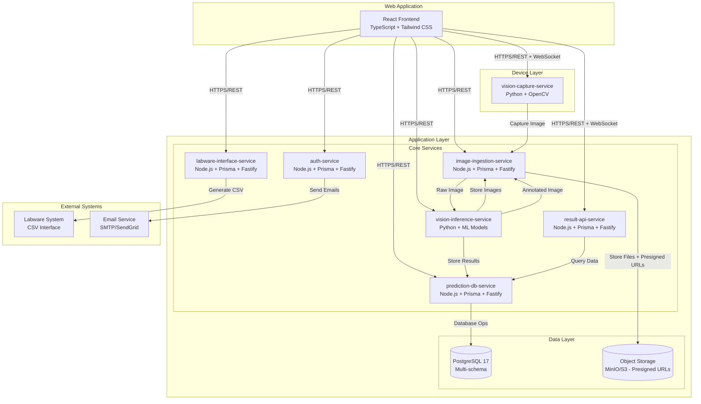

# Microplate AI System - Architecture Overview

## System Architecture

This document provides a comprehensive overview of the microservices architecture for the AI-powered Microplate analysis system.

### High-Level Architecture

## Service Responsibilities

### 1. Device Layer

#### vision-capture-service (Python)
- **Purpose**: Camera control and image capture
- **Technology**: Python + OpenCV + FastAPI
- **Responsibilities**:
  - Control USB/CSI cameras
  - Capture high-quality images
  - Provide live preview stream
  - Handle camera settings (exposure, brightness, etc.)

### 2. Application Layer

#### API Gateway & Internal Services
- **Purpose**: Frontend communicates with services through a unified gateway
- **Architecture**:
  - Requests pass through API gateway / reverse proxy (HTTPS)
  - Gateway validates JWT, applies rate limiting and CORS policies
  - Backend services focus on business logic and trust headers from gateway
  - Development workflowใช้ webpack-dev-server proxy แทน gateway
  - Health checksยังมีบนแต่ละ service สำหรับ monitoring

#### auth-service (Node.js + Prisma + Fastify)
- **Purpose**: User authentication and authorization
- **Responsibilities**:
  - User registration and login
  - JWT token management (access + refresh)
  - Password reset and forgot password flows
  - Role-based access control (RBAC)
  - User profile management

#### image-ingestion-service (Node.js + Prisma + Fastify)
- **Purpose**: Image storage and management
- **Responsibilities**:
  - Store raw and annotated images
  - Generate signed URLs for image access
  - Image metadata management
  - Integration with object storage (MinIO/S3)
  - Image processing and optimization

#### vision-inference-service (Python)
- **Purpose**: AI model inference and analysis
- **Responsibilities**:
  - Run ML models on captured images
  - Detect and classify objects in microplates
  - Calculate domain-specific logic
  - Generate bounding boxes and annotations
  - Send prediction results to prediction-db-service

#### prediction-db-service (Node.js + Prisma + Fastify)
- **Purpose**: Database operations for prediction data
- **Port**: 6406
- **Responsibilities**:
  - Store prediction runs and results
  - Manage well predictions and image files
  - Provide CRUD APIs for prediction data
  - Handle database migrations and schema management
  - Data validation and integrity checks

#### result-api-service (Node.js + Prisma + Fastify)
- **Purpose**: Data aggregation and API for results
- **Port**: 6404
- **Responsibilities**:
  - Query prediction data from prediction-db-service
  - Aggregate prediction results by sample
  - Provide REST APIs for frontend
  - Background worker for data processing
  - Real-time data updates via WebSocket
  - Generate summary statistics

#### labware-interface-service (Node.js + Prisma + Fastify)
- **Purpose**: Integration with external labware systems
- **Port**: 6403
- **Responsibilities**:
  - Generate CSV files per sample
  - Format data for labware compatibility
  - File management and delivery
  - Interface with shared folder systems

### 3. Web Application

#### React Frontend (TypeScript + Tailwind CSS)
- **Purpose**: User interface for the system
- **Responsibilities**:
  - Sample input (text/QR code)
  - Image display and capture interface
  - Real-time result visualization
  - User authentication flows
  - Responsive design for various screen sizes

## Data Flow

### 1. Image Capture and Analysis Flow
1. User enters sample information (sample_no, submission_no)
2. Frontend calls capture API via gateway
3. vision-capture-service captures image
4. Image stored in object storage via image-ingestion-service
5. vision-inference-service processes image and generates predictions
6. Results sent to prediction-db-service for storage
7. Frontend displays annotated image and results

### 2. Authentication Flow
1. User logs in via frontend
2. auth-service validates credentials
3. JWT tokens issued (access + refresh)
4. Gateway validates tokens for subsequent requests
5. Refresh tokens rotated for security

### 3. Data Aggregation Flow
1. New prediction results stored in prediction-db-service
2. Database trigger updates sample_summary table
3. result-api-service queries prediction-db-service for aggregation
4. Frontend receives real-time updates via WebSocket

## Security Considerations

- **JWT-based authentication** with access and refresh tokens
- **Role-based access control** (admin, operator, viewer)
- **Service-to-service authentication** using service tokens
- **Signed URLs** for image access with expiration
- **Rate limiting** and CORS protection at gateway
- **Input validation** and sanitization across all services
- **Audit logging** for all critical operations

## Scalability and Performance

- **Microservices architecture** for independent scaling
- **Database connection pooling** and query optimization
- **Object storage** for efficient image handling
- **Caching strategies** for frequently accessed data
- **Background workers** for heavy processing tasks
- **Health checks** and monitoring across all services

## Technology Stack

### Backend Services
- **Node.js** with TypeScript
- **Fastify** web framework
- **Prisma** ORM with PostgreSQL
- **JWT** for authentication
- **OpenAPI** for API documentation

### AI/ML Services
- **Python** with FastAPI
- **OpenCV** for image processing
- **ML models** for object detection and classification

### Frontend
- **React** with TypeScript
- **Tailwind CSS** for styling
- **TanStack Query** for data fetching
- **WebSocket** for real-time updates

### Infrastructure
- **PostgreSQL 17** for data storage
- **MinIO/S3** for object storage
- **Docker** for containerization
- **Nginx** for reverse proxy (optional)

## Next Steps

1. Review individual service specifications
2. Set up development environment
3. Implement database schema and migrations
4. Develop core services starting with auth-service
5. Build frontend components and pages
6. Implement integration testing
7. Deploy to staging and production environments
