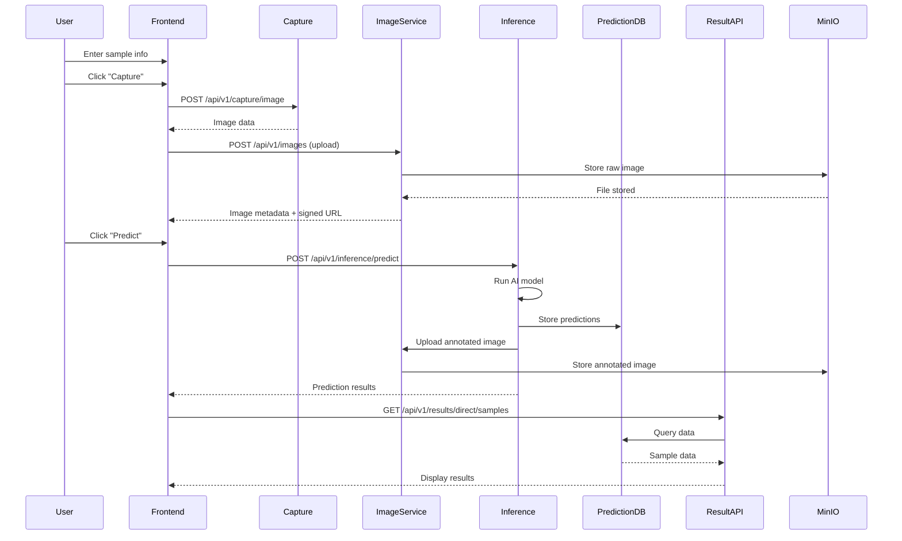
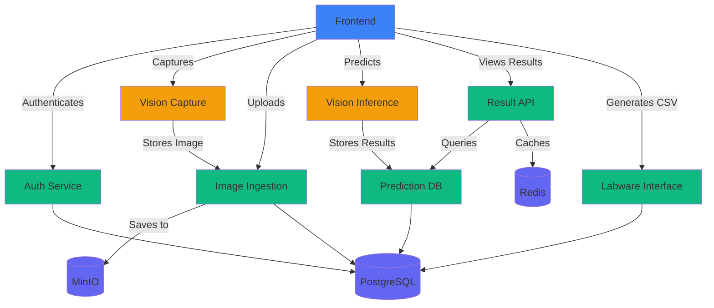

# Microplate AI System - Complete Documentation Index

> Comprehensive documentation for the Microplate AI System

---

## 📋 Documentation Navigation

### 🎯 Quick Start

**New to the project?** Start here:

1. 📖 **[Project Summary](00-Project-Summary.md)** - Complete system overview
2. 🏗️ **[Architecture Overview](01-Architecture-Overview.md)** - System design and components
3. 🚀 **[Quick Start Guide](#quick-start-guide)** - Get up and running in minutes

---

## 📚 Documentation Structure

### Core Documentation (Read First)

| # | Document | Description | Status |
|---|----------|-------------|--------|
| 00 | [Project Summary](00-Project-Summary.md) | Complete project overview and features | ✅ Complete |
| 01 | [Architecture Overview](01-Architecture-Overview.md) | System architecture and design patterns | ✅ Complete |
| 02 | [Database Schema](02-Database-Schema.md) | Complete database design with ERD | ✅ Complete |

### Service Documentation

| # | Service | Port | Document | Status |
|---|---------|------|----------|--------|
| 03 | Auth Service | 6401 | [Auth Service](03-Auth-Service.md) | ✅ Complete |
| 04 | Image Ingestion | 6402 | [Image Ingestion Service](04-Image-Ingestion-Service.md) | ✅ Complete |
| 05 | Vision Inference | 6405 | [Vision Inference Service](05-Vision-Inference-Service.md) | ✅ Complete |
| 06 | Result API | 6404 | [Result API Service](06-Result-API-Service.md) | ✅ Complete |
| 07 | Labware Interface | 6403 | [Labware Interface Service](07-Labware-Interface-Service.md) | ✅ Complete |
| 08 | Vision Capture | 6407 | [Vision Capture Service](08-Vision-Capture-Service.md) | ✅ Complete |
| 13 | Prediction DB | 6406 | [Prediction DB Service](13-Prediction-DB-Service.md) | ✅ Complete |

### Architecture & Design

| # | Document | Description | Status |
|---|----------|-------------|--------|
| 09 | [Direct Service Access](09-Direct-Service-Access.md) | Why no API Gateway? Architecture rationale | ✅ Complete |
| 10 | [Frontend Design](10-Frontend-Design.md) | Frontend architecture and components | ✅ Complete |
| 14 | [Service Port Allocation](14-Service-Port-Allocation.md) | Port mapping and network configuration | ✅ Complete |

### Implementation & Operations

| # | Document | Description | Status |
|---|----------|-------------|--------|
| 11 | [Implementation Guide](11-Implementation-Guide.md) | Step-by-step implementation | ✅ Complete |
| 12 | [Deployment Guide](12-Deployment-Guide.md) | Production deployment guide | ✅ Complete |
| 15 | [API Reference](15-API-Reference.md) | Complete API documentation | ✅ Complete |
| 16 | [Troubleshooting Guide](16-Troubleshooting-Guide.md) | Common issues and solutions | ✅ Complete |
| 17 | [Testing Strategy](17-Testing-Strategy.md) | Comprehensive testing guide | ✅ Complete |
| 18 | [Security Best Practices](18-Security-Best-Practices.md) | Security guidelines | ✅ Complete |

---

## 🎯 Quick Start Guide

### 1. System Requirements

**Prerequisites:**
- Node.js 18+
- Python 3.11+
- Docker 20+
- PostgreSQL 17 (or use Docker)
- Yarn 1.22+

**Hardware:**
- CPU: Quad-core processor
- RAM: 8 GB minimum, 16 GB recommended
- Storage: 50 GB SSD
- Camera: USB/CSI camera for image capture (optional)

### 2. Installation Steps

```bash
# 1. Clone repository
git clone <repository-url>
cd microplate-ai-system

# 2. Start infrastructure (PostgreSQL, MinIO, Redis)
cd microplate-be
docker-compose -f docker-compose.infra.yml up -d

# 3. Setup database
cd services/auth-service
yarn install
yarn prisma migrate deploy
yarn prisma db seed

# 4. Start backend services
cd ../..
docker-compose -f docker-compose.apps.yml up -d

# 5. Start frontend
cd ../microplate-fe
yarn install
yarn dev

# 6. Access application
# Frontend: http://localhost:6410
# Default credentials: admin@example.com / admin123
```

### 3. Verification

```bash
# Check all services are running
curl http://localhost:6401/healthz  # Auth Service
curl http://localhost:6402/healthz  # Image Ingestion
curl http://localhost:6403/healthz  # Labware Interface
curl http://localhost:6404/api/v1/results/health  # Result API
curl http://localhost:6405/api/v1/inference/health  # Vision Inference
curl http://localhost:6406/health  # Prediction DB
curl http://localhost:6407/api/v1/capture/health  # Vision Capture
```

---

## 🗺️ Documentation by Role

### For Developers

**Getting Started:**
1. [Implementation Guide](11-Implementation-Guide.md) - How to build the system
2. [Architecture Overview](01-Architecture-Overview.md) - Understand the design
3. [Database Schema](02-Database-Schema.md) - Database structure

**Service Development:**
- [Auth Service](03-Auth-Service.md) - Authentication implementation
- [Result API Service](06-Result-API-Service.md) - API development
- [Frontend Design](10-Frontend-Design.md) - UI/UX development

**Best Practices:**
- [Testing Strategy](17-Testing-Strategy.md) - How to test
- [Security Best Practices](18-Security-Best-Practices.md) - Security guidelines
- [Direct Service Access](09-Direct-Service-Access.md) - Architecture patterns

### For DevOps Engineers

**Deployment:**
1. [Deployment Guide](12-Deployment-Guide.md) - Production deployment
2. [Service Port Allocation](14-Service-Port-Allocation.md) - Network configuration
3. [Troubleshooting Guide](16-Troubleshooting-Guide.md) - Problem solving

**Operations:**
- [Database Schema](02-Database-Schema.md) - Database management
- [Security Best Practices](18-Security-Best-Practices.md) - Security hardening
- [API Reference](15-API-Reference.md) - API endpoints

### For Architects

**System Design:**
1. [Architecture Overview](01-Architecture-Overview.md) - System architecture
2. [Direct Service Access](09-Direct-Service-Access.md) - Architectural decisions
3. [Database Schema](02-Database-Schema.md) - Data model design

**Technical Details:**
- All service documentation (03-08, 13)
- [Service Port Allocation](14-Service-Port-Allocation.md)
- [API Reference](15-API-Reference.md)

### For QA Engineers

**Testing:**
1. [Testing Strategy](17-Testing-Strategy.md) - Complete testing guide
2. [API Reference](15-API-Reference.md) - API testing reference
3. [Troubleshooting Guide](16-Troubleshooting-Guide.md) - Bug investigation

---

## 🏗️ System Components

### Microservices Overview

```
┌─────────────────────────────────────────────────────────────┐
│                     Frontend Layer                          │
│  React + TypeScript + Tailwind CSS (Port 6410)              │
└─────────────────────────────────────────────────────────────┘
                          │
                ┌─────────┴─────────┐
                │                   │
┌───────────────▼───────────────────▼─────────────────────────┐
│              Application Layer - Microservices              │
├─────────────────────────────────────────────────────────────┤
│ Auth (6401) │ Image (6402) │ Labware (6403) │ Results (6404)│
│ Inference (6405) │ PredictionDB (6406) │ Capture (6407)    │
└─────────────────────────────────────────────────────────────┘
                          │
                ┌─────────┴─────────┐
                │                   │
┌───────────────▼───────────────────▼─────────────────────────┐
│                  Infrastructure Layer                       │
├─────────────────────────────────────────────────────────────┤
│  PostgreSQL 17  │  MinIO/S3  │  Redis  │  Prometheus │Grafana│
└─────────────────────────────────────────────────────────────┘
```

### Technology by Service

| Service | Primary Tech | Secondary Tech | Database |
|---------|-------------|----------------|----------|
| Auth | Node.js + TypeScript | Fastify + Prisma | PostgreSQL (auth schema) |
| Image Ingestion | Node.js + TypeScript | Fastify + Prisma + Sharp | PostgreSQL + MinIO |
| Labware Interface | Node.js + TypeScript | Fastify + Prisma | PostgreSQL |
| Result API | Node.js + TypeScript | Fastify + Prisma + WS | PostgreSQL + Redis |
| Vision Inference | Python | FastAPI + PyTorch | PostgreSQL |
| Prediction DB | Node.js + TypeScript | Fastify + Prisma | PostgreSQL (microplates schema) |
| Vision Capture | Python | FastAPI + OpenCV | - |
| Frontend | React + TypeScript | Vite + Tailwind CSS | - |

---

## 🔌 Service Ports Reference

| Service | Port | Protocol | Health Check |
|---------|------|----------|--------------|
| **Auth Service** | 6401 | HTTP | `GET /healthz` |
| **Image Ingestion** | 6402 | HTTP | `GET /healthz` |
| **Labware Interface** | 6403 | HTTP | `GET /healthz` |
| **Result API** | 6404 | HTTP/WS | `GET /api/v1/results/health` |
| **Vision Inference** | 6405 | HTTP | `GET /api/v1/inference/health` |
| **Prediction DB** | 6406 | HTTP | `GET /health` |
| **Vision Capture** | 6407 | HTTP/WS | `GET /api/v1/capture/health` |
| **Frontend** | 6410 | HTTP | - |
| **PostgreSQL** | 5432 | PostgreSQL | - |
| **Redis** | 6379 | Redis | - |
| **MinIO API** | 9000 | HTTP (S3) | `GET /minio/health/live` |
| **MinIO Console** | 9001 | HTTP | - |

---

## 📖 Documentation by Topic

### Authentication & Security

- [Auth Service](03-Auth-Service.md) - Complete authentication service
- [Security Best Practices](18-Security-Best-Practices.md) - Security guidelines
- [Direct Service Access](09-Direct-Service-Access.md) - Service security model

**Key Topics:**
- JWT token management
- Role-based access control
- Password policies
- Token rotation
- API security

### Database & Data

- [Database Schema](02-Database-Schema.md) - Complete schema design
- [Prediction DB Service](13-Prediction-DB-Service.md) - Database operations
- [Result API Service](06-Result-API-Service.md) - Data aggregation

**Key Topics:**
- Multi-schema design (auth, microplates, public)
- Database triggers and functions
- Data aggregation strategy
- Performance optimization
- Backup and recovery

### Image Processing & AI

- [Image Ingestion Service](04-Image-Ingestion-Service.md) - Image storage
- [Vision Inference Service](05-Vision-Inference-Service.md) - AI inference
- [Vision Capture Service](08-Vision-Capture-Service.md) - Camera control

**Key Topics:**
- Image upload and storage
- Signed URL generation
- YOLO model inference
- Bounding box annotation
- Camera configuration

### User Interface

- [Frontend Design](10-Frontend-Design.md) - UI/UX design
- [Implementation Guide](11-Implementation-Guide.md) - Frontend development

**Key Topics:**
- React component architecture
- State management with TanStack Query
- Real-time WebSocket updates
- Responsive design
- Accessibility

### Deployment & Operations

- [Deployment Guide](12-Deployment-Guide.md) - Production deployment
- [Service Port Allocation](14-Service-Port-Allocation.md) - Network setup
- [Troubleshooting Guide](16-Troubleshooting-Guide.md) - Problem solving

**Key Topics:**
- Docker deployment
- Kubernetes deployment
- Cloud platforms (AWS, Azure, GCP)
- Monitoring with Prometheus/Grafana
- Health checks and logging

### Testing & Quality

- [Testing Strategy](17-Testing-Strategy.md) - Comprehensive testing
- [Implementation Guide](11-Implementation-Guide.md) - Code quality

**Key Topics:**
- Unit testing
- Integration testing
- E2E testing with Cypress
- Performance testing with k6
- Security testing

---

## 🔍 Finding Information

### By Service

- **Auth Service** → [03-Auth-Service.md](03-Auth-Service.md)
- **Image Ingestion** → [04-Image-Ingestion-Service.md](04-Image-Ingestion-Service.md)
- **Vision Inference** → [05-Vision-Inference-Service.md](05-Vision-Inference-Service.md)
- **Result API** → [06-Result-API-Service.md](06-Result-API-Service.md)
- **Labware Interface** → [07-Labware-Interface-Service.md](07-Labware-Interface-Service.md)
- **Vision Capture** → [08-Vision-Capture-Service.md](08-Vision-Capture-Service.md)
- **Prediction DB** → [13-Prediction-DB-Service.md](13-Prediction-DB-Service.md)

### By Technology

**Node.js + TypeScript:**
- Auth Service, Image Ingestion, Labware Interface, Result API, Prediction DB
- See [Implementation Guide](11-Implementation-Guide.md) for setup

**Python + FastAPI:**
- Vision Inference Service, Vision Capture Service
- See individual service docs for setup

**React + TypeScript:**
- Frontend application
- See [Frontend Design](10-Frontend-Design.md)

**PostgreSQL:**
- Database schema and design
- See [Database Schema](02-Database-Schema.md)

### By Task

**I want to...**

- 🔧 **Install the system** → [Quick Start](#quick-start-guide) → [Implementation Guide](11-Implementation-Guide.md)
- 🚀 **Deploy to production** → [Deployment Guide](12-Deployment-Guide.md)
- 🔐 **Implement authentication** → [Auth Service](03-Auth-Service.md)
- 🤖 **Add AI features** → [Vision Inference Service](05-Vision-Inference-Service.md)
- 📊 **Work with results** → [Result API Service](06-Result-API-Service.md)
- 🐛 **Fix a bug** → [Troubleshooting Guide](16-Troubleshooting-Guide.md)
- ✅ **Write tests** → [Testing Strategy](17-Testing-Strategy.md)
- 🔒 **Improve security** → [Security Best Practices](18-Security-Best-Practices.md)
- 📡 **Understand architecture** → [Architecture Overview](01-Architecture-Overview.md)
- 🔌 **Use the API** → [API Reference](15-API-Reference.md)

---

## 📊 System Overview

### Data Flow



### Service Dependencies



---

## 🎓 Learning Path

### Beginner Track

If you're new to the project, follow this path:

1. **Week 1: Understanding**
   - Read [Project Summary](00-Project-Summary.md)
   - Review [Architecture Overview](01-Architecture-Overview.md)
   - Study [Database Schema](02-Database-Schema.md)

2. **Week 2: Setup**
   - Follow [Implementation Guide](11-Implementation-Guide.md)
   - Set up development environment
   - Run the system locally

3. **Week 3: Development**
   - Study service documentation (03-08, 13)
   - Make small changes
   - Run tests

4. **Week 4: Testing**
   - Read [Testing Strategy](17-Testing-Strategy.md)
   - Write tests for your changes
   - Review [Security Best Practices](18-Security-Best-Practices.md)

### Advanced Track

For experienced developers:

1. **Architecture Deep Dive**
   - [Architecture Overview](01-Architecture-Overview.md)
   - [Direct Service Access](09-Direct-Service-Access.md)
   - [Service Port Allocation](14-Service-Port-Allocation.md)

2. **Service Implementation**
   - Choose a service to work on
   - Read its documentation
   - Implement features or improvements

3. **DevOps & Deployment**
   - [Deployment Guide](12-Deployment-Guide.md)
   - Set up Kubernetes
   - Configure monitoring

4. **Security & Quality**
   - [Security Best Practices](18-Security-Best-Practices.md)
   - [Testing Strategy](17-Testing-Strategy.md)
   - Implement security features

---

## 📋 Documentation Checklist

### Before Development

- [ ] Read Project Summary
- [ ] Understand Architecture
- [ ] Review Database Schema
- [ ] Set up development environment
- [ ] Review relevant service documentation

### During Development

- [ ] Follow implementation guide
- [ ] Write unit tests
- [ ] Update API documentation
- [ ] Check security best practices
- [ ] Run linting and type checking

### Before Deployment

- [ ] Review deployment guide
- [ ] Run integration tests
- [ ] Check security configuration
- [ ] Verify health checks
- [ ] Review troubleshooting guide

---

## 🔗 External Resources

### Official Documentation

- [Node.js Docs](https://nodejs.org/docs)
- [Python Docs](https://docs.python.org)
- [React Docs](https://react.dev)
- [FastAPI Docs](https://fastapi.tiangolo.com)
- [Prisma Docs](https://www.prisma.io/docs)
- [PostgreSQL Docs](https://www.postgresql.org/docs)

### Learning Resources

- [TypeScript Handbook](https://www.typescriptlang.org/docs/handbook)
- [Tailwind CSS Docs](https://tailwindcss.com/docs)
- [Docker Docs](https://docs.docker.com)
- [Kubernetes Docs](https://kubernetes.io/docs)

### Tools

- [Postman](https://www.postman.com) - API testing
- [pgAdmin](https://www.pgadmin.org) - PostgreSQL GUI
- [VS Code](https://code.visualstudio.com) - Code editor
- [Docker Desktop](https://www.docker.com/products/docker-desktop)

---

## 🆘 Getting Help

### Documentation Issues

If you find issues in the documentation:

1. Check if information is in another document
2. Search across all documentation files
3. Create an issue with specific details
4. Suggest improvements via pull request

### Technical Support

- 📖 **Documentation** - Check this index and linked docs
- 🐛 **Troubleshooting** - See [Troubleshooting Guide](16-Troubleshooting-Guide.md)
- 💬 **Community** - GitHub Discussions
- 📧 **Email** - support@microplate-ai.com

---

## 📝 Document Status Legend

- ✅ **Complete** - Comprehensive and ready to use
- 🔄 **In Progress** - Being updated
- 📝 **Draft** - Initial version, needs review
- ⚠️ **Outdated** - Needs update

All documents in this index are marked as ✅ **Complete**.

---

## 🎯 Quick Reference

### Common Commands

```bash
# Start everything
docker-compose -f microplate-be/docker-compose.infra.yml up -d
docker-compose -f microplate-be/docker-compose.apps.yml up -d
cd microplate-fe && yarn dev

# Check health
curl http://localhost:6401/healthz  # Auth
curl http://localhost:6404/api/v1/results/health  # Results

# View logs
docker-compose -f microplate-be/docker-compose.apps.yml logs -f

# Stop everything
docker-compose -f microplate-be/docker-compose.apps.yml down
docker-compose -f microplate-be/docker-compose.infra.yml down
```

### Common API Calls

```bash
# Login
curl -X POST http://localhost:6401/api/v1/auth/login \
  -H "Content-Type: application/json" \
  -d '{"username":"admin@example.com","password":"admin123"}'

# Get samples
curl http://localhost:6404/api/v1/results/direct/samples \
  -H "Authorization: Bearer $TOKEN"

# Capture image
curl -X POST http://localhost:6407/api/v1/capture/image \
  -H "Authorization: Bearer $TOKEN" \
  -H "Content-Type: application/json" \
  -d '{"sample_no":"TEST001","quality":95}'
```

---

## 📅 Document Maintenance

### Review Schedule

- **Monthly**: Review for accuracy
- **Quarterly**: Update for new features
- **Major Release**: Complete documentation review
- **On Issue**: Update specific sections

### Contributing to Documentation

1. Create branch: `docs/update-xyz`
2. Make changes
3. Test examples and commands
4. Submit pull request
5. Request review

---

## 📞 Contact

### Documentation Team

- 📧 Email: docs@microplate-ai.com
- 💬 Slack: #documentation
- 🐛 Issues: GitHub Issues with `documentation` label

### Version Information

- **Documentation Version:** 1.0.0
- **Last Updated:** January 2024
- **Maintained By:** Microplate AI Team

---

<div align="center">

## 🎉 Happy Coding!

This documentation covers everything you need to build, deploy, and maintain the Microplate AI System.

**Questions?** Check the [Troubleshooting Guide](16-Troubleshooting-Guide.md) or [open an issue](https://github.com/your-org/microplate-ai/issues).

---

[⬆ Back to Top](#microplate-ai-system---complete-documentation-index)

</div>
