# Microplate AI System Architecture

## 1. Overall System Architecture

## 2. Service Details

## 3. Database Schema

## 4. Image Upload & Prediction Flow

## 5. PVC Storage Structure

```mermaid
flowchart TB
    subgraph PVC["PVC: pvc-labware-dev (10Gi)"]
        subgraph images["📁 /mnt/storage/images"]
            img1["📁 sp001/"]
            img2["📁 sp002/"]
            img1_file["📄 sp001_20260201_abc.jpg"]
            img2_file["📄 sp002_20260201_def.jpg"]
        end

        subgraph annotated["📁 /mnt/storage/annotated-images"]
            ann1["📁 sp001/"]
            ann2["📁 sp002/"]
            ann1_file["📄 sp001_20260201_abc_annotated.jpg"]
            ann2_file["📄 sp002_20260201_def_annotated.jpg"]
        end

        subgraph exports["📁 /mnt/storage/labware-exports"]
            exp1["📁 sp001/"]
            exp1_file["📄 sp001_results.csv"]
        end
    end

    IMG["Image Ingestion<br/>mount: /app/data"] -->|write| images
    WORK["Vision Workers<br/>mount: /mnt/storage"] -->|read| images
    WORK -->|write| annotated
    LAB["Labware Interface<br/>mount: /mnt/storage"] -->|write| exports
```

## 6. Worker Processing Flow

## 7. Status State Machine

## 8. Authentication Flow

## 9. Deployment Architecture

## 10. Network Flow

---

## Quick Reference

| Service | Port | Technology | Purpose |
|---------|------|------------|---------|
| Frontend | 80 | React/TypeScript | Web UI |
| Auth | 6401 | Node.js/Express | JWT + Azure AD |
| Image Ingestion | 6402 | Node.js/Express | File storage |
| Vision API | 6403 | Python/FastAPI | AI inference API |
| Result API | 6404 | Node.js/Express | Data aggregation |
| Labware Interface | 6405 | Node.js/Express | CSV export |
| Prediction DB | 6406 | Node.js/Express | Prediction CRUD |
| Device | 6407 | Python/FastAPI | Camera capture (local) |
| RabbitMQ | 5672 | RabbitMQ | Message queue |
| PostgreSQL | 5432 | PostgreSQL | Database |
